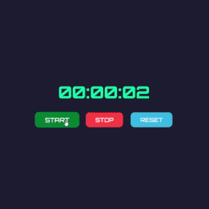

# ⏱️ Stopwatch

A clean and responsive **React** stopwatch app that lets you start, stop, and reset the timer with ease.

---

## 📌 Features
- ✅ **Start/Stop/Reset**: Control the stopwatch with intuitive buttons.
- ✅ **Time Formatting**: Displays time in `HH:MM:SS` format.
- ✅ **Responsive Design**: Simple, centered layout for all devices.
- ✅ **Separate CSS File**: Easy to tweak styles in `Clock.css`.
- ✅ **Beginner Friendly**: Uses `useState` and `useRef` for state and timer control.

---

## 🛠️ Technologies Used
- ⚛️ **React** (`useState`, `useRef` for time tracking)
- 🎨 **CSS** (`Clock.css` for layout and button styling)
- 📄 **HTML / JSX** (structured inside the `Clock.js` component)

---


## 🚀 Live Demo
To see it in action, clone the repository and follow the setup instructions below.

1. **Clone the repository:**

   ```bash
   git clone  https://github.com/Eshhaa11/react-stopwatch
   
   
2. **Navigate to the project directory:**

   cd  react-stopwatch

3. **Install dependencies:**

   npm install

4. **Start the development server:**

   npm start

5. **Open your browser and visit:**

   http://localhost:3000

---

 ## 🎨 Screenshots:


 ---

 ## 🤝 Contributing:
 Want to improve this project? Fork the repository, create a feature branch, and open a pull request. All contributions are welcome! 🚀✨
 
 ---

 🎉 Happy Coding!